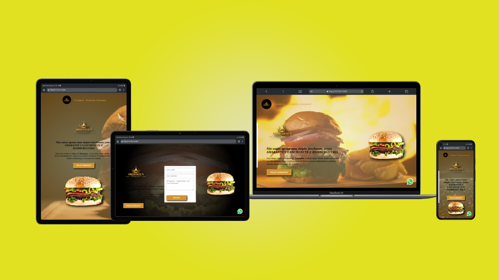

<h1>Projeto Piloto</h1>
 
 

Eu gosto de ajudar pessoas! Este  foi o primeiro projeto concluido com sucesso. Projeto esse, feito na inteção de ajudar um amigo.
Então nesse projeto eu consegui <b>Estudar, Aprender, Aplicar</b> e o mais importante <b>Ajudar uma pessoa</b> :sunglasses::satisfied::grin::smiley::wink:

 
<ul>
    <h3>Tecnologias usadas</h3>
    <li></li>
    <li></li>
    <li></li>
</ul> 

<h3>Confira o resultado acessando <a href="https://amarantes-hamburgueria.netlify.app/">Amarante's Hamburgueria</a> </h3>
 

